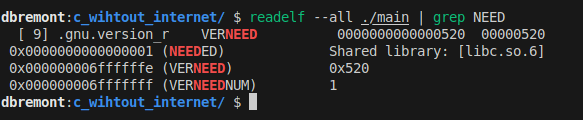
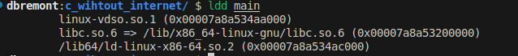

# Code Reading C Code

> ...

QA:

- (❓) How a dissembler works? Can I Read An ELF File Using `xxd` only?
- (❓) How to convert a binary file to a `hex file`?  How many bytes are needed to encode a `hex` character?
- (❓) What is the essence of a number system? What is the relation of **enumeration** and **counting**? How large numbers (compound) are build from **primitives ones**?
- (❓) How the byte ordering **affects** the disassembly process?
- What is the differentce betweeen `ldd` and `readelf -- all .. || grep NEED`?

## C ELF

Dependencies

lld

> `file main`  ↠ `ELF 64-bit LSB pie executable, x86-64, version 1 (SYSV), dynamically linked, interpreter /lib64/ld-linux-x86-64.so.2, BuildID[sha1]=f1e7a29fd7d0dfdd8348ace90d5224936de9a89e, for GNU/Linux 3.2.0, not stripped`

Assembly: `objdump -s main  > main.as`

## References

- `aspell`
